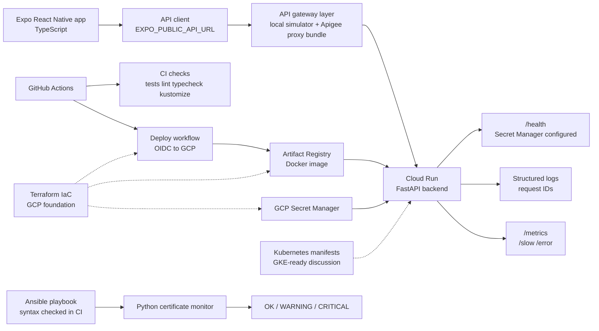

# Mobile Platform Reliability Lab

Public learning lab for mobile platform DevOps, API reliability, and SRE practice.

This repository uses fake demo data only. It is not affiliated with any bank, employer, or internal platform. It contains no real customer data, no real credentials, and no production secrets.

## Purpose

The goal is to build a small, explainable workflow that connects mobile delivery, API reliability, CI/CD, containers, Kubernetes, GCP deployment options, certificate automation, Ansible, and observability.

It is intentionally not enterprise scale. The point is to show initiative, technical range, and the ability to reason through a mobile platform delivery path.

## What This Demonstrates

- Expo React Native TypeScript client calling a cloud-hosted backend through environment-based configuration.
- Python FastAPI backend with fake demo data, structured logs, health checks, metrics-style output, and incident simulation endpoints.
- Docker image build and Cloud Run deployment through Artifact Registry.
- GitHub Actions CI for backend, mobile, Docker, Kubernetes manifests, certificate automation, Ansible, gateway, and Apigee proxy XML validation.
- GitHub Actions deployment to Cloud Run using Google Cloud Workload Identity Federation instead of service account keys.
- GCP Secret Manager runtime secret injection without exposing secret values.
- Terraform foundation for repeatable GCP resource provisioning.
- Kubernetes manifests for GKE/platform discussion.
- Python certificate expiry automation and Ansible configuration automation.
- API management concepts through a local gateway simulator and an Apigee-style proxy bundle.

## Architecture



## Current Working Proof Points

- Public GitHub repository with passing CI.
- Manual GitHub Actions deployment workflow successfully deploys the backend to Cloud Run.
- Cloud Run backend is reachable over HTTPS.
- Runtime secret is injected from GCP Secret Manager and verified by `/health` without exposing the value.
- Apigee proxy bundle XML is validated in CI.
- Ansible playbook syntax is validated in CI.
- Terraform formatting and validation run in CI.
- Kubernetes manifests render with Kustomize in CI.

## Folder Map

- `backend/` - Python FastAPI API with fake data, tests, structured logging, and incident simulation endpoints.
- `gateway/` - Small API gateway simulator showing API proxy, API key, rate limit, target routing, and request ID concepts.
- `apigee/` - Apigee-style proxy bundle with API key, quota, spike arrest, and target routing policy examples.
- `mobile/` - Expo React Native TypeScript app that calls the backend through an environment-based API URL.
- `k8s/` - Kubernetes namespace, deployment, service, config, secret placeholder, and optional ingress examples.
- `infra/terraform/` - Terraform foundation for GCP APIs, Artifact Registry, Secret Manager, IAM, and Workload Identity Federation.
- `automation/` - Python certificate expiry monitor.
- `ansible/` - Inventory, variables, and playbook examples for deploying or scheduling automation.
- `.github/workflows/` - CI checks plus manual Terraform and Cloud Run deployment workflows.

## Current Status

Phase 1 is the FastAPI backend:

- `GET /health`
- `GET /accounts`
- `POST /payments`
- `GET /slow`
- `GET /error`
- `GET /metrics`

Phase 2 adds Docker and CI validation:

- Backend Dockerfile.
- Backend Docker build check in GitHub Actions.
- Backend tests and lint in GitHub Actions.

Phase 3 adds the mobile client:

- Expo React Native TypeScript app.
- API health check button.
- Fetch accounts button.
- Make demo payment button.
- Loading, success, and error states.
- `EXPO_PUBLIC_API_URL` configuration.

Phase 4 adds Kubernetes manifests:

- Namespace.
- Deployment with two replicas.
- ClusterIP service.
- ConfigMap for non-secret config.
- Placeholder Secret example.
- Readiness and liveness probes using `/health`.
- Optional ingress example.

Phase 5 adds GCP deployment notes:

- Cloud Run path for a simple container deployment.
- Artifact Registry image path.
- GKE Autopilot path for Kubernetes discussion.
- Cost warning and cleanup commands.

Phase 6 adds certificate automation:

- Python certificate expiry monitor.
- Endpoint list file.
- OK, WARNING, and CRITICAL classification.
- Non-zero exit codes for alerting or scheduling.
- Unit tests for parsing and expiry classification.

Phase 7 adds Ansible automation:

- Inventory for certificate monitor targets.
- Variables for endpoint list and thresholds.
- Template for endpoint configuration.
- Playbook to install and configure the certificate monitor.
- Scheduling example for Linux cron.

Phase 8 adds observability and incident docs:

- Structured logging explanation.
- Metrics, health, slow, and error endpoint mapping.
- Splunk and Dynatrace discussion.
- Mobile API incident runbook.

Phase 9 adds mobile DevOps overview:

- iOS build/signing concepts.
- Android build/signing concepts.
- Mobile CI/CD checks.
- Mobile release risk and rollback notes.

Phase 10 adds Apigee/API management overview:

- API proxy concepts.
- Policy examples.
- Apigee Hybrid high-level model.
- Mobile API troubleshooting through a gateway.

Phase 11 adds API gateway implementation artifacts:

- Mobile-facing `/mobile/v1` routes.
- Backend target routing.
- API key validation.
- Simple rate limiting.
- Request ID propagation.
- Gateway tests and CI validation.
- Apigee-style proxy bundle with API key, quota, spike arrest, and target routing policy examples.

Phase 12 adds secure cloud runtime configuration:

- Workload Identity Federation for GitHub Actions to GCP authentication.
- Secret Manager runtime secret injection for Cloud Run.
- Health endpoint confirms whether runtime secret configuration is present without returning the secret value.

## Local Backend Run

```powershell
cd mobile-platform-reliability-lab
cd backend
python -m venv .venv
.\.venv\Scripts\Activate.ps1
python -m pip install --upgrade pip
python -m pip install -r requirements.txt
python -m pytest
python -m uvicorn app.main:app --reload
```

Successful test output should end with something like:

```text
6 passed
```

Successful server startup should include:

```text
Uvicorn running on http://127.0.0.1:8000
```

## Docker Backend Run

From the repository root:

```powershell
docker build -t mobile-platform-reliability-api:local .\backend
docker run --rm -p 8000:8000 mobile-platform-reliability-api:local
```

Check the container:

```powershell
Invoke-RestMethod http://127.0.0.1:8000/health
```

## CI/CD

The main GitHub Actions workflow is in `.github/workflows/ci.yml`.

It currently validates:

- Python dependency installation.
- Backend tests with `pytest`.
- Backend linting with `ruff`.
- Docker image build for the FastAPI backend.
- Mobile dependency installation with `npm ci`.
- Mobile TypeScript validation with `npm run typecheck`.
- Mobile linting with `npm run lint`.
- Kubernetes manifest rendering with `kubectl kustomize`.
- Terraform formatting and validation.
- Certificate automation tests and linting.
- Ansible playbook syntax validation.
- Apigee proxy XML validation.

The manual deployment workflow is in `.github/workflows/cloud-run-deploy.yml`.

It demonstrates this release flow:

```text
GitHub Actions -> Docker build -> Artifact Registry push -> Cloud Run deploy
```

It uses GitHub Actions secrets as placeholders for Google Cloud authentication. No real cloud credentials are committed to the repository.

The deployment workflow also demonstrates runtime secret injection from GCP Secret Manager. The backend health endpoint reports whether the runtime secret is configured without exposing the secret value.

The Terraform workflows are manual:

- `.github/workflows/terraform-plan.yml`
- `.github/workflows/terraform-apply.yml`
- `.github/workflows/terraform-destroy.yml`

Recommended demo order:

```text
Terraform Apply -> Cloud Run Deploy -> verify /health -> delete Cloud Run -> Terraform Destroy
```

## Kubernetes

The `k8s/` folder contains manifest examples for running the backend in Kubernetes.

Validate the manifests without deploying:

```powershell
kubectl kustomize .\k8s
```

Apply to a local Kubernetes cluster:

```powershell
kubectl apply -k .\k8s
kubectl get pods -n mobile-platform-lab
kubectl get svc -n mobile-platform-lab
```

Cleanup:

```powershell
kubectl delete namespace mobile-platform-lab
```

For a real GCP cluster, the local image name would be replaced with an Artifact Registry image path.

## Infrastructure As Code

The `infra/terraform/` folder describes the GCP foundation as Terraform:

- Required GCP APIs.
- Artifact Registry repository.
- Secret Manager secret metadata.
- Cloud Run runtime service account.
- IAM bindings.
- Access for an existing GitHub Actions deployer service account.
- Container API support for the optional live GKE Autopilot demo.
- Optional Terraform-managed GKE Autopilot cluster for the live Kubernetes demo.

Terraform does not store secret values, does not create service account JSON keys, and does not own the GitHub OIDC bootstrap resources. The GitHub workflows use GCS remote state through a `TF_STATE_BUCKET` repository variable.

The Cloud Resource Manager API must be enabled as part of bootstrap before Terraform can manage project IAM.

Validate locally:

```powershell
cd infra\terraform
terraform fmt -check
terraform init -backend=false
terraform validate
```

This lab keeps Terraform focused on foundation provisioning while GitHub Actions handles application deployment.

Manual GitHub Actions flow:

```text
Terraform Plan  -> review planned foundation resources
Terraform Apply -> create app foundation and add fake demo secret version
Deploy Backend To Cloud Run -> build/push/deploy the backend image
Terraform Destroy -> remove Terraform-managed foundation after Cloud Run is deleted
```

Before running `Terraform Destroy`, delete the Cloud Run service so the Artifact Registry repository can be removed cleanly.

## GCP Deployment Notes

See `docs/gcp-deployment.md`.
For the actual read-and-follow Cloud Run demo, see `docs/cloud-run-demo-guide.md`.

Recommended path for this lab:

```text
Docker image -> Artifact Registry -> Cloud Run
```

Kubernetes discussion path:

```text
Docker image -> Artifact Registry -> GKE Autopilot -> Kubernetes manifests
```

Cloud Run is the practical low-complexity path. GKE is included for Kubernetes platform discussion and should be used carefully because clusters can create ongoing cost. The live GKE LoadBalancer walkthrough uses Terraform to create the optional Autopilot cluster and GitHub Actions to deploy the backend to Kubernetes. See `docs/gke-live-loadbalancer-demo.md`.

## Certificate Automation

The `automation/` folder contains a Python certificate expiry monitor.

Run tests:

```powershell
cd automation
python -m pytest
```

Run against example endpoints:

```powershell
python .\cert_check.py --endpoints-file .\endpoints.example.txt --warning-days 30 --critical-days 14
```

## Ansible

The `ansible/` folder shows how the certificate monitor could be installed and configured repeatably.

Syntax check:

```powershell
ansible-playbook -i .\ansible\inventory.ini .\ansible\install_cert_monitor.yml --syntax-check
```

Ansible is easiest to run from WSL or Linux/macOS. This lab keeps the playbook public-safe and uses placeholder/public endpoints only.

## Observability

See:

- `docs/observability.md`
- `docs/runbooks/mobile-api-incident.md`

The lab demonstrates observability through structured logs, `/health`, `/metrics`, `/slow`, `/error`, and request IDs. These map to the kind of troubleshooting a mobile platform team would do with Splunk, Dynatrace, gateway logs, and backend logs.

## Mobile DevOps Overview

See `docs/mobile-devops-overview.md`.

This explains iOS and Android build/release concepts, including macOS runners, Xcode, provisioning profiles, Android keystores, Gradle, Play Console tracks, and why mobile rollback is different from backend rollback.

## Apigee API Management

See `docs/apigee-api-management.md`.

The lab does not deploy a real Apigee Hybrid runtime, but it explains where Apigee would sit between the Expo mobile app and FastAPI backend, and how gateway policies, routing, analytics, certificates, quotas, and rate limits affect mobile API reliability.

The `gateway/` folder implements a small local API gateway simulator to make those API management ideas concrete without requiring a real Apigee organization.

The `apigee/` folder contains an Apigee-style proxy bundle with proxy endpoint, target endpoint, API key verification, quota, spike arrest, and header enrichment policy examples. CI validates the proxy XML files.

## How This Maps To Mobile Platform DevOps

Mobile platform engineers often sit between app teams, API teams, CI/CD systems, cloud infrastructure, and observability platforms. This lab demonstrates that flow in miniature:

- The mobile app needs a stable API contract and environment-specific configuration.
- The backend needs health checks, predictable errors, logs, and deployment packaging.
- CI/CD needs to validate both TypeScript mobile code and Python backend code.
- Kubernetes or Cloud Run provides a deployable runtime path.
- Certificate checks reduce production risk before mobile users see failures.
- Observability tools help connect symptoms like login failures or payment errors to backend health, latency, logs, and traces.

## Future Improvements

- Add more operational runbooks.
- Add optional GKE deployment walkthrough.
- Add sample Splunk or Dynatrace dashboard/query examples.
